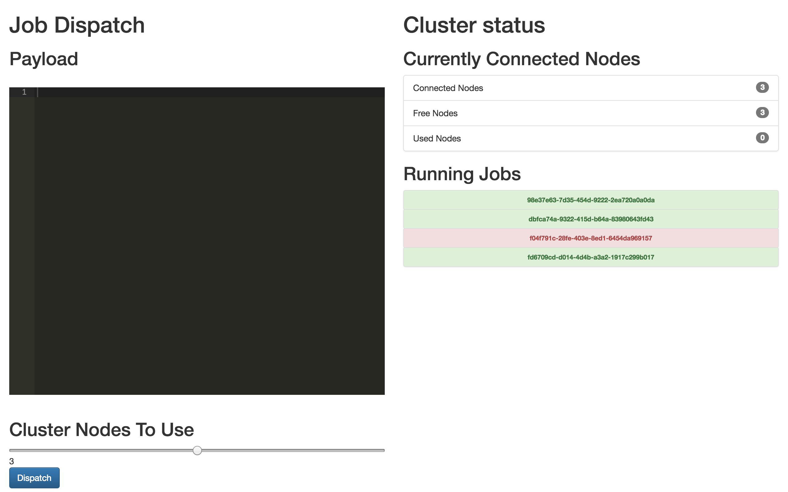

#Distribute[WIP]

A project to distribute map reduce jobs to client browsers.

Each client will open a page and open a connection with the socket server.

Nodes are pooled and managed and dispatched depending on a job's requirements.



## Usage
### Install Requirements
```
pip install -r requirements.txt
```

### Start Server
```
python server.py
```

### Run simple test(for now)
```
curl localhost:5000/test
```
### Important urls

```
/
```

Start a new node in the cluster


```
/console
```

Open the console to view jobs and to dispatch new jobs.

## Payload specifications

Imagine the payload is arbitrary javascript code that follows the function
declaration.

```
// where payload_data is the input data that was assigned to this node
function(payload_data) {
    // your code here
    ...
    // OPTIONAL return value
    return [0];
}
```

Where payload data is the array slice that this particular node has been
assigned.
